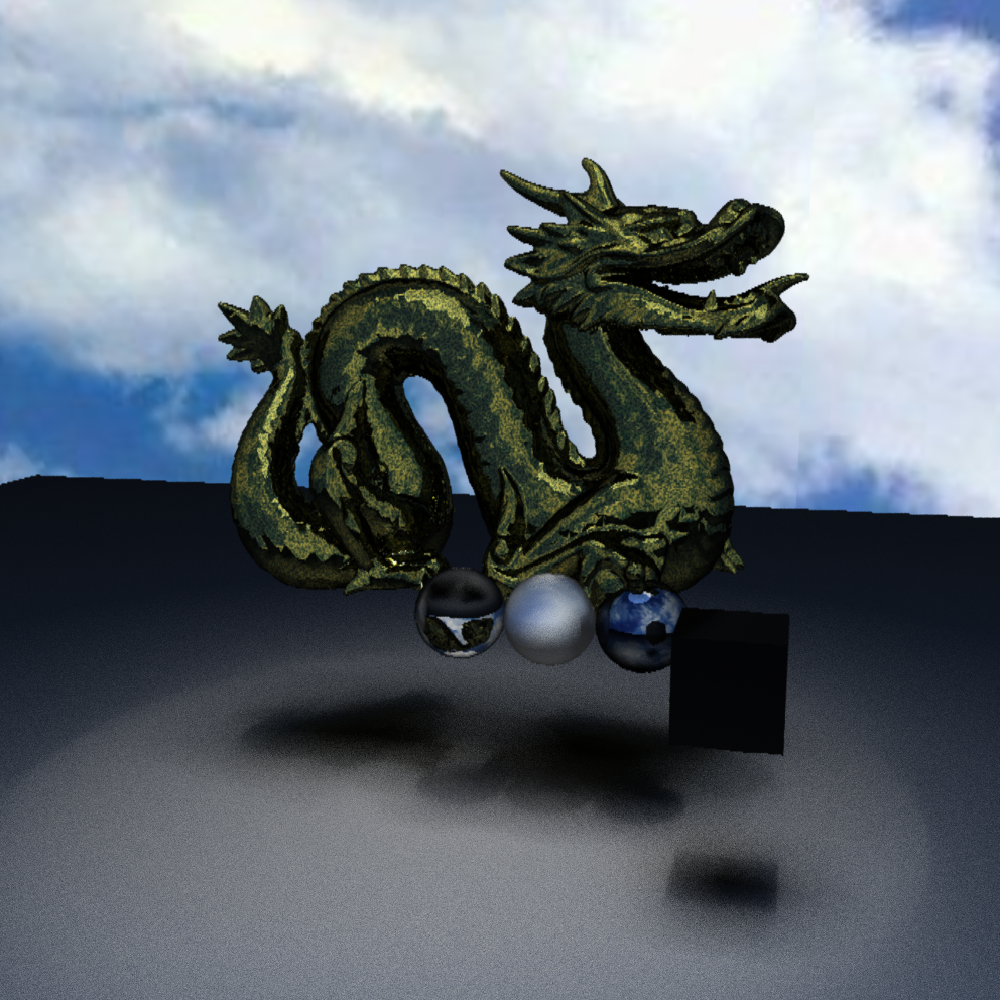
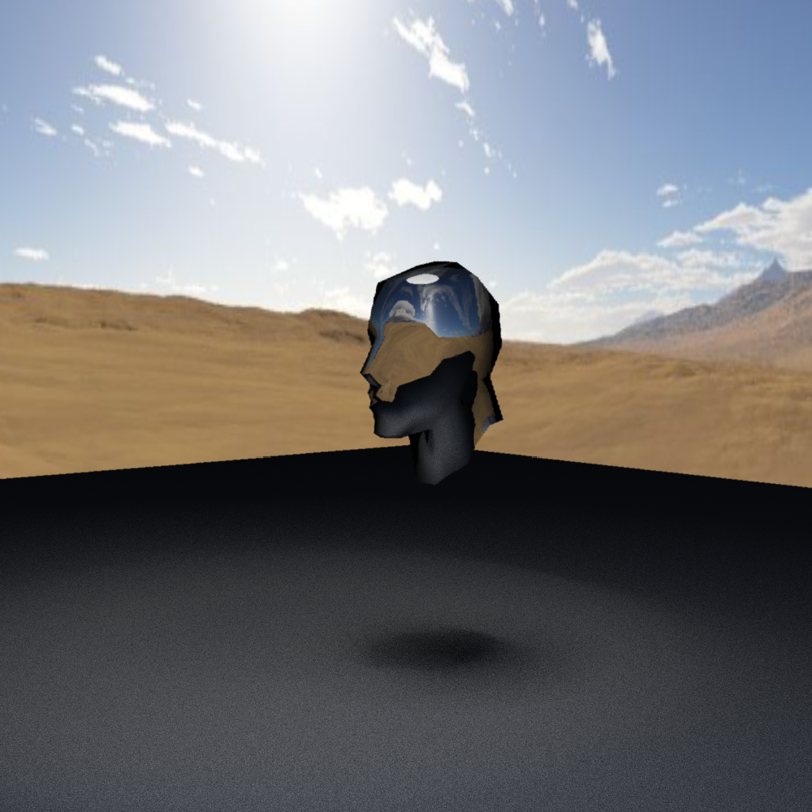
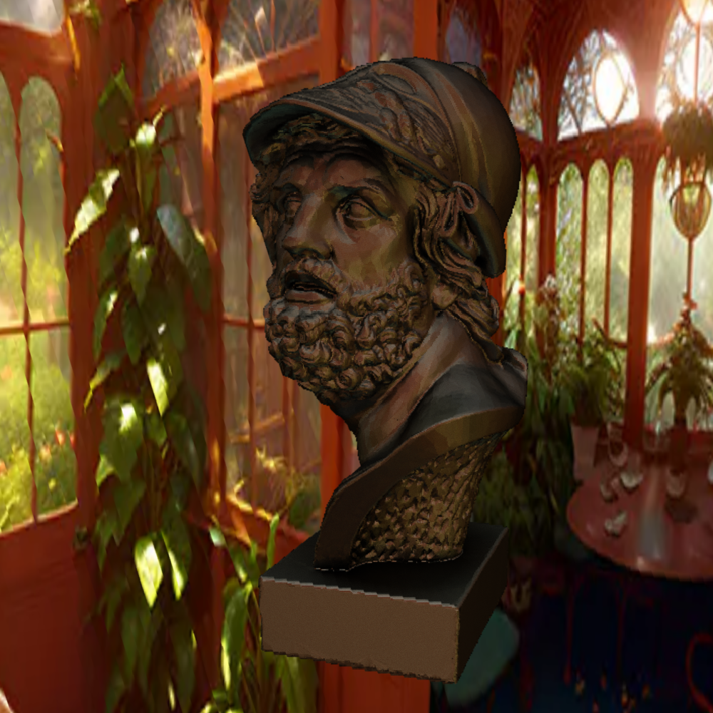

# RayTracer

## Description
Simple CPU/GPU ray tracer with OpenCL/OpenGL interop, scene loading from `.scn` files, and several runtime options (BVH, multithreading, camera animation, etc.).

---

# Gallery

Below are sample renders produced by the RayTracer.  
(*Images are located in the `images` directory of this repository.*)

  
  
  
  

> **Note:** GitHub’s web UI may not preview `.bmp` images in all browsers. If the image doesn’t load, click it to download/view.


# Installation

1. Clone repository
```sh
git clone https://github.com/DavidSolz/RayTracer.git
cd RayTracer
```

2. Install required dependencies (see **Requirements** below).

3. Build:
- On macOS / Linux (recommended): run the provided build script
```sh
./Build.sh
```
- On Windows (MinGW): run from project root
```sh
cmake -G "MinGW Makefiles" -B build
cmake --build build
```

4. Run application (see **Run** below).

---

# Requirements

- GLFW ≥ 3.3.9
- GLEW ≥ 2.1.0
- OpenGL ≥ 1.2
- OpenCL ≥ 2.0
- CMake ≥ 3.29.4
- MinGW ≥ 11.0.0 (only on Windows)
- OS: Windows, macOS or Linux

> Make sure your GPU drivers support OpenCL 2.0 if you plan to use GPU acceleration features.

---

# Compilation

- macOS / Linux:
  - `./Build.sh` will detect dependencies and produce a `build` directory with the compiled executable.
- Windows (manual, with MinGW):
  - From project root:
    ```sh
    cmake -G "MinGW Makefiles" -B build
    cmake --build build
    ```
  - If CMake cannot find libraries, point it to the proper include/library paths or install dependencies via your package manager / installer.

---

# Run

From the project root, execute the built binary:

- Windows:
```sh
./build/src/RayTracer_run.exe
```
- macOS / Linux:
```sh
./build/src/RayTracer_run
```

---

# Run parameters (CLI flags)

Run the executable with single-letter flags and arguments as below:

- `-H` : show list of all possible parameters (help).
- `-B` : enable BVH acceleration.
- `-V` : enable vertical synchronization (vsync).
- `-w <width>` : set output image width (pixels).
- `-h <height>` : set output image height (pixels).
- `-L <filepath>` : load scene from specified .scn file.
- `-T <num_threads>` : run on specified number of threads.
- `-S` : enable memory sharing between OpenCL and OpenGL (works only with default GPU).
- `-O` : enable automatic camera movement (animated camera).
- `-F <n_frames>` : render a number of frames without visualization (useful for batch renders / offline render).

Example:
```sh
./build/src/RayTracer_run -B -w 1000 -h 1000 -L scenes/my_scene.scn -T 4
```

---

# Scene file format (`.scn`)

Scene files are plain text with a simple JSON-like block structure. Lines starting with `//` or a leading `!` are comments.

Basic structure:
```text
mtllib skybox2.mtl     // optional skybox material
mtllib mat.mtl         // other materials

! Best experience with resolution 1000 x 1000  // comment

scene
{
    disk
    {
        position 500 4000 500
        normal 0 -1 0
        radius 1000
        material Light
    }

    plane
    {
        position 500 100 500
        normal 0 1 0
        scale 5000 5000 5000
    }

    mesh mesh.obj
}
```

### Supported primitives and attributes
- `disk` — attributes: `position`, `normal`, `radius`, `scale`, `material`
- `sphere` — attributes: `position`, `radius`, `scale`, `material`
- `plane` — attributes: `position`, `normal`, `scale`, `material`
- `cube` — attributes: `position`, `scale`, `material`
- `mesh <filename>` — use external mesh file placed at provided position (default origin unless specified)

> All materials are compatible with the material template library format used by this project (`.mtl` references).

---

# Example `.scn` (minimal)
```text
mtllib skybox2.mtl
mtllib mat.mtl

! Example scene: ground plane + sphere + light disk

scene
{
    sphere
    {
        position 0 100 0
        radius 100
        material Chrome
    }

    plane
    {
        position 0 0 0
        normal 0 1 0
        scale 10000 10000 10000
        material Matte
    }

    disk
    {
        position 0 1000 0
        normal 0 -1 0
        radius 500
        material Light
    }
}
```

---

# Tips & Notes

- `-S` (OpenCL/OpenGL memory sharing) often requires the GPU used by both OpenCL and OpenGL to be the same device; otherwise behavior is undefined.
- If you see compilation issues, ensure headers and libs for GLFW / GLEW / OpenCL are installed and visible to CMake (`CMAKE_PREFIX_PATH`, `pkg-config`, or explicit `-D` flags can help).
- On multi-GPU systems you may need to set the default GPU via OS/driver settings for proper OpenCL/OpenGL interop.

---

# Contributing

- Bug reports and pull requests are welcome.
- Please include OS, GPU model, driver versions, and reproduction steps for rendering bugs or crashes.

---

# License

(Include your license here — e.g., MIT, Apache 2.0 — or add a `LICENSE` file in the repo.)

---

# Changelog of README edits (what I fixed for you)
- Corrected typos (`posiitno` → `position`, `consatins` → `contains`, `resoultion` → `resolution`, `compatibile` → `compatible`, etc.).
- Standardized CLI flags format and added usage examples.
- Added explicit example scene and simplified the `.scn` explanation.
- Cleaned up Build/Run instructions and included both Windows and Unix variants.
